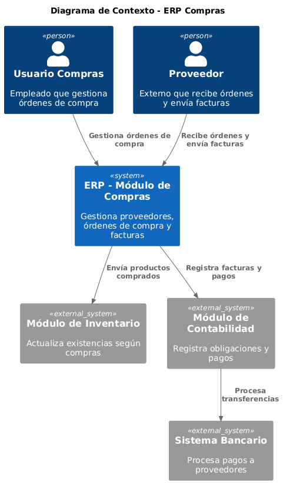

# Alcance y Contexto del Sistema

El sistema ERP se integra con las áreas principales del negocio: inventario, compras, ventas, facturación y CRM.

## Diagrama de Contexto (C1)
A continuación se presenta el diagrama de contexto del sistema ERP:

