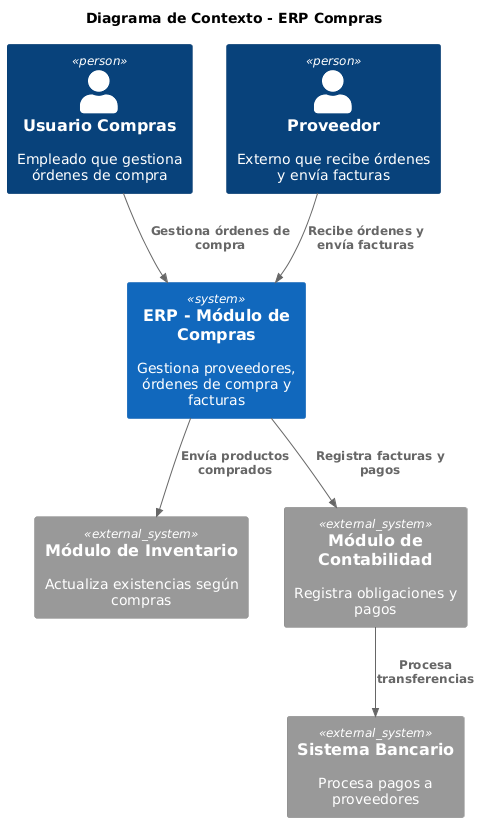
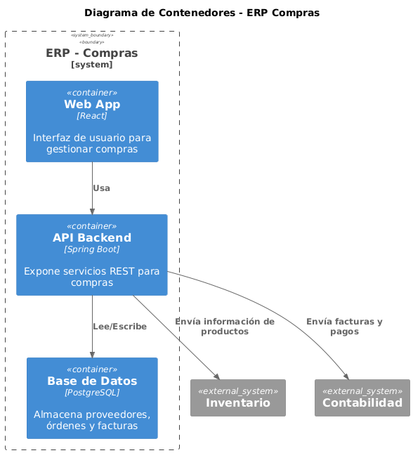
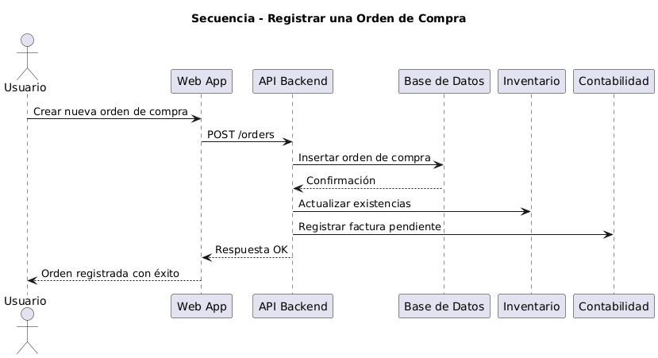
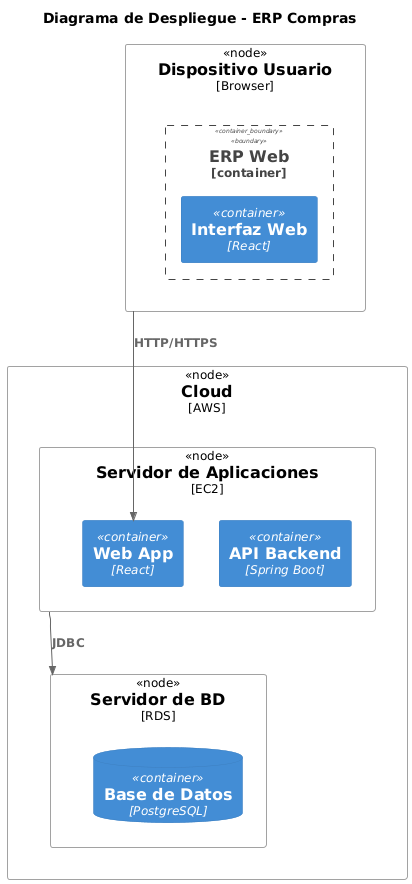

# ERP - Módulo de Compras

Este proyecto corresponde al diseño arquitectónico (arc42) del **Módulo de Compras** dentro de un sistema ERP.

## Contenido

- `c1_context.puml`: Diagrama de Contexto (nivel C1).
- `c2_containers.puml`: Diagrama de Contenedores (nivel C2).
- `deployment.puml`: Diagrama de Despliegue.
- `sequence_register_sale.puml`: Diagrama de Secuencia para el registro de una compra.

## Visualización de Diagramas

Los diagramas están escritos en **PlantUML**.  
Para generarlos:

```bash

## 📊 Diagramas principales
- **Contexto (C1):** 
- **Contenedores (C2):** 
- **Secuencia HU1:** 
- **Despliegue:** 
```

## Objetivo del Módulo

- Gestionar **proveedores**, **órdenes de compra** y **facturas**.  
- Asegurar la trazabilidad de las compras desde la solicitud hasta el pago.  
- Integrarse con **Inventario** y **Contabilidad**.
